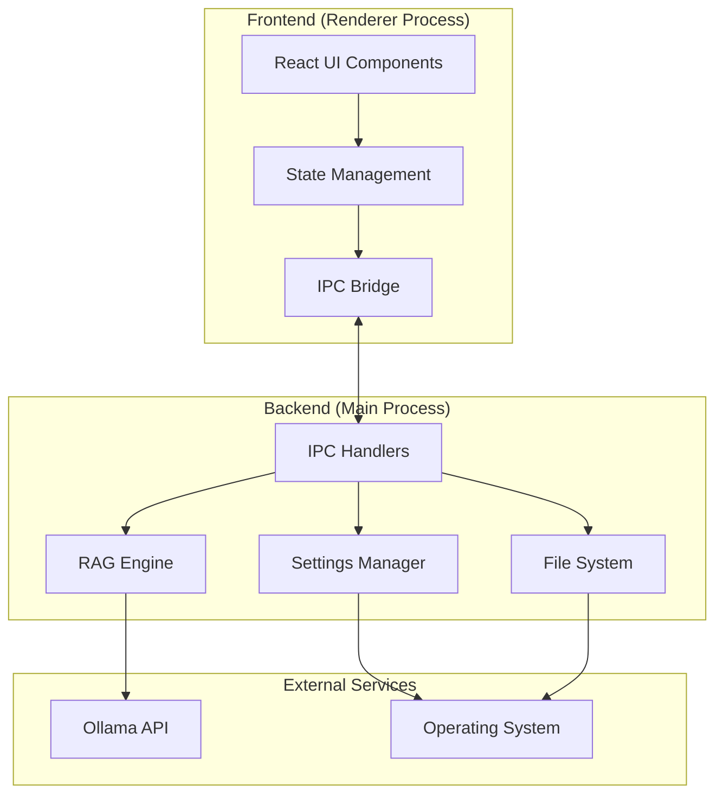

# Helios Technical Documentation

A comprehensive technical guide to understanding, developing, and extending the Helios desktop AI assistant.

## 📋 Table of Contents

- [Architecture Overview](#architecture-overview)
- [Technology Stack](#technology-stack)
- [Project Structure](#project-structure)
- [Core Systems](#core-systems)
- [API Documentation](#api-documentation)
- [Development Guide](#development-guide)
- [Testing Strategy](#testing-strategy)
- [Performance Optimization](#performance-optimization)
- [Security Considerations](#security-considerations)
- [Deployment](#deployment)

## 🏗️ Architecture Overview

Helios follows a modern desktop application architecture with clear separation between frontend UI, backend services, and external integrations.



### Process Architecture

**Main Process (Electron)**
- Application lifecycle management
- File system operations
- Settings persistence
- RAG document indexing
- IPC communication hub
- Ollama API integration

**Renderer Process (React)**
- User interface rendering
- User interaction handling
- State management
- Real-time updates
- File drag-and-drop

**Communication Flow**
1. User interaction triggers React event
2. React component calls IPC bridge
3. Main process handles request
4. External API calls (Ollama)
5. Response flows back through IPC
6. UI updates with new state

## 🛠️ Technology Stack

### Core Technologies

| Component | Technology | Version | Purpose |
|-----------|------------|---------|---------|
| **Runtime** | Electron | ^36.5.0 | Desktop app framework |
| **Frontend** | React | ^19.1.0 | UI framework |
| **Language** | TypeScript | ~5.8.3 | Type safety |
| **Styling** | Tailwind CSS | ^4.1.10 | Utility-first CSS |
| **Build Tool** | Vite | ^6.3.5 | Fast build system |
| **Package Manager** | Electron Forge | ^7.8.1 | App packaging |

### Development Tools

| Tool | Purpose | Configuration |
|------|---------|---------------|
| **ESLint** | Code linting | `eslint.config.js` |
| **Jest** | Unit testing | `jest.config.js` |
| **TypeScript** | Type checking | `tsconfig.json` |
| **Prettier** | Code formatting | `.prettierrc` |
| **Husky** | Git hooks | `.husky/` |

### External Dependencies

```json
{
  "ai": {
    "ollama": "Local LLM runtime",
    "models": "qwen3:4b, llama3.2, deepseek-coder"
  },
  "ui": {
    "@headlessui/react": "Accessible UI components",
    "lucide-react": "Icon library",
    "react-markdown": "Markdown rendering"
  },
  "data": {
    "csv-parser": "CSV file processing",
    "mammoth": "DOCX processing",
    "xlsx": "Excel file support"
  }
}
```

## 📁 Project Structure

```
helios/
├── 📁 src/                     # Frontend React application
│   ├── 📄 App-full.tsx         # Main application component
│   ├── 📄 vite-env.d.ts       # TypeScript environment definitions
│   ├── 📁 components/          # Reusable UI components
│   ├── 📁 features/            # Feature-specific components
│   ├── 📁 services/            # Frontend service layer
│   ├── 📁 theme/               # Theming system
│   └── 📁 stores/              # State management
│
├── 📁 electron/                # Electron main process
│   ├── 📄 main.ts             # Core application logic (800+ lines)
│   ├── 📄 preload.js          # IPC bridge security layer
│   └── 📄 forge.config.ts     # Electron Forge configuration
│
├── 📁 docs/                    # Documentation
│   ├── 📄 CLAUDE.md           # Development memory/context
│   ├── 📄 TECH.md             # This technical documentation
│   └── 📁 screenshots/        # UI screenshots
│
├── 📁 tests/                   # Test suites
│   ├── 📁 unit/               # Unit tests
│   ├── 📁 integration/        # Integration tests
│   └── 📁 e2e/                # End-to-end tests
│
├── 📄 package.json            # Dependencies and scripts
├── 📄 tsconfig.json           # TypeScript configuration
├── 📄 vite.config.ts          # Vite build configuration
├── 📄 tailwind.config.js      # Tailwind CSS configuration
└── 📄 eslint.config.js        # ESLint configuration
```

### Key File Descriptions

**`src/App-full.tsx`** (Primary Component)
- Single-file architecture containing all UI logic
- 5000+ lines of TypeScript/React code
- Handles chat, settings, RAG, document mode
- Direct IPC communication
- Real-time state management

**`electron/main.ts`** (Backend Core)
- Main process logic and IPC handlers
- RAG document indexing engine
- Settings persistence system
- Ollama API integration
- File system operations

**`electron/preload.js`** (Security Bridge)
- Secure IPC communication layer
- Exposes limited APIs to renderer
- Context isolation implementation

## 🔧 Core Systems

### 1. State Management

**React State Architecture**
```typescript
// Primary state structure in App-full.tsx
const [conversations, setConversations] = useState<Conversation[]>([]);
const [settings, setSettings] = useState<Settings>({
  showThinking: true,
  ragEnabled: true,
  ragDirectories: [],
  ragSensitivity: 80,
  selectedModel: '',
  turnBasedThinking: true,
  temperature: 0.7,
  contextLength: 40000,
  topP: 0.9,
  topK: 40,
  repeatPenalty: 1.1
});
const [ragStatus, setRagStatus] = useState<RagStatus>({...});
const [streamingMessage, setStreamingMessage] = useState<StreamingMessage | null>(null);
```

**State Persistence**
- Settings auto-saved to `userData/helios-settings.json`
- Conversations auto-saved to `userData/helios-conversations.json`
- RAG index maintained in main process
- Legacy migration handled automatically

**Conversation Management**
```typescript
interface Conversation {
  id: string;
  title: string;
  messages: Message[];
  createdAt: Date;
}

// AI-powered title generation
const generateChatTitle = async (messages: Message[]): Promise<string> => {
  // Uses conversation context to generate intelligent titles
  // Updates after every message for dynamic naming
  // Runs asynchronously to avoid blocking UI
}
```

### 2. Inter-Process Communication (IPC)

**Security Model**
```typescript
// preload.js - Secure API exposure
const electronAPI = {
  invoke: (channel: string, ...args: any[]) => ipcRenderer.invoke(channel, ...args),
  on: (channel: string, callback: Function) => ipcRenderer.on(channel, callback),
  removeAllListeners: (channel: string) => ipcRenderer.removeAllListeners(channel)
};

contextBridge.exposeInMainWorld('electron', electronAPI);
```

**IPC Channel Mapping**
| Channel | Direction | Purpose |
|---------|-----------|---------|
| `settings:load` | R→M | Load persisted settings |
| `settings:save` | R→M | Save settings to disk |
| `conversations:load` | R→M | Load conversation history |
| `conversations:save` | R→M | Save conversation history |
| `ollama:list` | R→M | Get available models |
| `ollama:chat` | R→M | Send chat request |
| `ollama:chat:stream` | M→R | Streaming response |
| `rag:index-all-directories` | R→M | Index documents |
| `rag:status` | R→M | Get RAG status |
| `dialog:select-directory` | R→M | File picker dialog |
| `fs:open-directory` | R→M | Open file location |
| `fs:read-file` | R→M | Read file content |

### 3. RAG (Retrieval-Augmented Generation) Engine

**Multi-Directory Architecture**
```typescript
// Backend RAG settings
const ragSettings = {
  directories: [] as string[],    // Up to 3 directories
  sensitivity: 80,                // 10-100% threshold
  lastIndexed: 0,
  isIndexing: false
};

// Document database
interface DocumentChunk {
  content: string;
  file: string;
  lastModified: number;
}
const ragDatabase: DocumentChunk[] = [];
```

**Indexing Process**
1. **File Discovery**: Recursive directory scanning
2. **Format Detection**: Support for `.md`, `.txt`, `.json`, `.csv`
3. **Content Processing**: Special handling for CSV, chunking for large files
4. **Storage**: In-memory database with metadata
5. **Auto-Sync**: Periodic re-indexing (daily)

**Search Algorithm**
```typescript
// Scoring system with configurable sensitivity
const scoredDocs = ragDatabase
  .map(doc => {
    const docContent = doc.content.toLowerCase();
    let score = 0;
    let matchedTerms = 0;
    
    searchTerms.forEach(term => {
      if (docContent.match(new RegExp(`\\b${term}\\b`))) {
        score += 3; // Exact word match
        matchedTerms++;
      } else if (docContent.includes(term)) {
        score += 1; // Substring match
        matchedTerms++;
      }
    });
    
    // Bonus for multiple term matches
    if (matchedTerms > 1) {
      score += matchedTerms * 2;
    }
    
    return { doc, score, matchedTerms };
  })
  .filter(item => {
    // Configurable sensitivity threshold
    const maxPossibleScore = searchTerms.length * 5;
    const minScore = (ragSettings.sensitivity / 100) * maxPossibleScore;
    return item.score >= Math.max(1, minScore);
  })
  .sort((a, b) => b.score - a.score)
  .slice(0, 3); // Top 3 results
```

### 4. Ollama Integration

**API Communication**
```typescript
// Chat request with model parameters
const response = await fetch('http://localhost:11434/api/chat', {
  method: 'POST',
  headers: { 'Content-Type': 'application/json' },
  body: JSON.stringify({
    model: selectedModel,
    messages: enhancedMessages,
    stream: true,
    think: supportsThinking,
    options: {
      temperature: settings.temperature,
      num_ctx: settings.contextLength,
      top_p: settings.topP,
      top_k: settings.topK,
      repeat_penalty: settings.repeatPenalty
    }
  })
});
```

**Streaming Response Handling**
```typescript
// Real-time streaming with thinking support
const reader = response.body?.getReader();
const decoder = new TextDecoder();
let buffer = '';

while (true) {
  const { value, done } = await reader.read();
  if (done) break;
  
  buffer += decoder.decode(value, { stream: true });
  const lines = buffer.split('\\n');
  buffer = lines.pop() || '';
  
  for (const line of lines) {
    if (line.trim()) {
      const parsed = JSON.parse(line);
      
      // Send to renderer for real-time updates
      mainWindow.webContents.send('ollama:chat:stream', parsed);
      
      // Accumulate final message
      if (parsed.message?.content) {
        fullMessage.content += parsed.message.content;
      }
      if (parsed.message?.thinking) {
        fullMessage.thinking += parsed.message.thinking;
      }
    }
  }
}
```

**Model Management**
- **Auto-Installation**: Default model (`qwen3:4b`) installed on first run
- **Capability Detection**: Automatic thinking/vision support detection
- **Progress Tracking**: Real-time installation progress via streaming
- **Error Handling**: Graceful fallbacks and user notifications

### 5. Document Mode (Amazon-Style)

**Context Management**
```typescript
interface DocumentContext {
  title: string;
  sections: { question: string; answer: string; }[];
  isBuilding: boolean;
}

// Amazon writing principles integration
const contextPrompt = `You are helping build an Amazon-style document titled "${title}".
Follow Amazon's writing principles:
- Start with the bottom line up front
- Use data-driven insights
- Be crisp and clear
- Structure logically with clear sections
- Focus on customer impact

Current progress: ${sections.length} sections completed.`;
```

**Markdown Generation**
```typescript
const generateAmazonStyleDocument = (context: DocumentContext): string => {
  const sections = context.sections.map((section, index) => {
    const sectionTitle = section.question
      .replace(/[?!.]/g, '')
      .split(' ')
      .map(word => word.charAt(0).toUpperCase() + word.slice(1))
      .join(' ');
    
    return `## ${sectionTitle}\n\n${section.answer}`;
  }).join('\n\n');
  
  return `# ${context.title}\n\n## Executive Summary\n\n${context.sections[0]?.answer || ''}\n\n${sections.slice(1).join('\n\n')}\n\n---\n*Document generated on ${new Date().toLocaleDateString()} using Helios AI Assistant*\n*Total sections: ${context.sections.length}*`;
};
```

## 📡 API Documentation

### IPC Handler Reference

#### Settings Management

**`settings:load`**
```typescript
// Request: void
// Response: Settings
interface Settings {
  showThinking: boolean;
  ragEnabled: boolean;
  ragDirectories: string[];
  ragSensitivity: number;
  selectedModel: string;
  turnBasedThinking: boolean;
  temperature: number;
  contextLength: number;
  topP: number;
  topK: number;
  repeatPenalty: number;
}
```

**`settings:save`**
```typescript
// Request: Settings
// Response: { success: boolean }
```

#### Ollama Integration

**`ollama:list`**
```typescript
// Request: void
// Response: OllamaModel[]
interface OllamaModel {
  name: string;
  size: number;
  modified_at: string;
}
```

**`ollama:chat`**
```typescript
// Request: ChatRequest
interface ChatRequest {
  model: string;
  messages: Message[];
  ragEnabled: boolean;
  think?: boolean;
  options?: {
    temperature?: number;
    num_ctx?: number;
    top_p?: number;
    top_k?: number;
    repeat_penalty?: number;
  };
}

// Response: ChatResponse[] (streaming via 'ollama:chat:stream')
interface ChatResponse {
  message: {
    content: string;
    thinking?: string;
  };
  done: boolean;
}
```

#### RAG Operations

**`rag:index-all-directories`**
```typescript
// Request: void
// Response: IndexResult
interface IndexResult {
  success: boolean;
  documentCount: number;
  lastIndexed: number;
}
```

**`rag:status`**
```typescript
// Request: void
// Response: RagStatus
interface RagStatus {
  isIndexing: boolean;
  documentCount: number;
  lastIndexed: number;
  directories: string[];
  sensitivity: number;
}
```

#### File System

**`dialog:select-directory`**
```typescript
// Request: void
// Response: string | null (selected directory path)
```

**`fs:open-directory`**
```typescript
// Request: string (file path)
// Response: { success: boolean }
// Opens file location in system file explorer/Finder
```

**`fs:read-file`**
```typescript
// Request: string (file path)
// Response: FileContent
interface FileContent {
  success: boolean;
  content: string;
  filePath: string;
  size: number;
  lastModified: number;
  fileName: string;
}
```

#### Conversation Management

**`conversations:load`**
```typescript
// Request: void
// Response: Conversation[]
interface Conversation {
  id: string;
  title: string;
  messages: Message[];
  createdAt: Date;
}
```

**`conversations:save`**
```typescript
// Request: Conversation[]
// Response: { success: boolean }
```

### Event Listeners (Main → Renderer)

**`ollama:chat:stream`**
- Real-time streaming of chat responses
- Includes both content and thinking data

**`rag:indexing-status`**
- Progress updates during document indexing
- Status messages and document counts

**`ollama:install-progress`**
- Model installation progress
- Download status and completion

**`rag:sources-found`**
- RAG sources for current query
- Document excerpts and file paths

### 4. UI Components & Features

**Conversation Persistence**
```typescript
// Auto-save conversations after each message
const saveConversations = async (conversations: Conversation[]) => {
  if (window.electron) {
    await window.electron.invoke('conversations:save', conversations);
  }
};

// AI-powered title generation runs asynchronously
const generateChatTitle = async (messages: Message[]) => {
  const conversationContext = messages.map(m => `${m.role}: ${m.content}`).join('\n');
  const titlePrompt = `Generate a concise, descriptive title for this conversation: ${conversationContext}`;
  // Title generation happens in background without blocking UI
};
```

**RAG Source Navigation**
```typescript
// Dual-button system for RAG sources
const RAGSourceButtons = ({ source }: { source: RAGSource }) => (
  <div style={{ display: 'flex', gap: '4px' }}>
    {/* File Explorer Button */}
    <button onClick={() => openFileInExplorer(source.filePath)}>
      📁 {source.fileName}
    </button>
    
    {/* Content Viewer Button */}
    <button onClick={() => viewFileContent(source.filePath)}>
      👁️
    </button>
  </div>
);

// File explorer integration
const openFileInExplorer = async (filePath: string) => {
  await window.electron.invoke('fs:open-directory', filePath);
};
```

**Historical Content Preservation**
```typescript
// Always show thinking and RAG content regardless of current settings
{message.thinking && (  // No settings.showThinking check
  <ThinkingBubble content={message.thinking} />
)}

{message.ragSources && (  // No settings.ragEnabled check
  <RAGSources sources={message.ragSources} />
)}
```

## 🧪 Development Guide

### Environment Setup

1. **Prerequisites**
   ```bash
   # Node.js (LTS version)
   node --version  # v18+
   
   # Ollama installation
   curl -fsSL https://ollama.ai/install.sh | sh
   ollama serve
   ```

2. **Project Setup**
   ```bash
   git clone <repo-url>
   cd helios
   npm install
   npm run dev
   ```

### Development Workflow

**Hot Reload Development**
```bash
# Terminal 1: Frontend development
npm run dev:renderer

# Terminal 2: Full app with hot reload
npm run dev

# Terminal 3: TypeScript checking
npm run typecheck --watch
```

**Code Quality**
```bash
# Linting
npm run lint
npm run lint --fix

# Testing
npm test
npm run test:watch
npm run test:coverage

# Type checking
npm run typecheck
```

### Architecture Decisions

**Single-File Frontend**
- `App-full.tsx` contains all UI logic (5000+ lines)
- **Pros**: Simplified state management, no prop drilling, easier debugging
- **Cons**: Large file size, potential merge conflicts
- **Alternative**: Component-based architecture in `components/` directory

**Direct IPC Communication**
- No abstraction layer between React and Electron
- **Pros**: Simple, fast, transparent
- **Cons**: Tight coupling, harder to test
- **Alternative**: Service layer architecture in `services/`

**In-Memory RAG Database**
- Documents stored in main process memory
- **Pros**: Fast search, no external dependencies
- **Cons**: Memory usage, no persistence across restarts
- **Alternative**: SQLite or embedded vector database

**File-Based Conversation Persistence**
- Conversations stored as JSON in userData directory
- **Pros**: Simple implementation, human-readable format, automatic sync
- **Cons**: Potential data loss if file corrupted, no version control
- **Alternative**: SQLite database with migration support

**AI-Powered Chat Naming**
- Title generation after every message using current model
- **Pros**: Always up-to-date titles, reflects conversation evolution
- **Cons**: Additional API calls, slight performance overhead
- **Alternative**: Manual naming or static timestamps

### Adding New Features

**1. New IPC Handler**
```typescript
// electron/main.ts
ipcMain.handle('feature:new-action', async (event, data) => {
  try {
    // Implementation
    return { success: true, result: data };
  } catch (error) {
    console.error('Feature error:', error);
    throw error;
  }
});
```

**2. Frontend Integration**
```typescript
// src/App-full.tsx
const newFeatureAction = async (data: any) => {
  try {
    if (window.electron) {
      const result = await window.electron.invoke('feature:new-action', data);
      console.log('Feature result:', result);
    }
  } catch (error) {
    console.error('Failed to execute feature:', error);
  }
};
```

**3. Settings Extension**
```typescript
// Update Settings interface
interface Settings {
  // ... existing settings
  newFeatureSetting: boolean;
}

// Update default settings in both main and renderer
const defaultSettings = {
  // ... existing defaults
  newFeatureSetting: false
};
```

### Debugging Strategies

**Electron Development Tools**
```bash
# Open DevTools for renderer process
Ctrl+Shift+I (Windows/Linux)
Cmd+Option+I (macOS)

# Debug main process
npm run dev -- --inspect=5858
# Then open chrome://inspect in Chrome
```

**Logging System**
```typescript
// Structured logging
console.log('[RAG]', 'Indexing started:', directory);
console.error('[Ollama]', 'Connection failed:', error);
console.debug('[IPC]', 'Message received:', channel, data);
```

**Common Debug Points**
- IPC communication failures
- Ollama connection issues
- RAG indexing problems
- Settings persistence errors
- File system permission issues

## 🧪 Testing Strategy

### Test Structure

```
tests/
├── unit/
│   ├── components/         # React component tests
│   ├── services/          # Service layer tests
│   └── utils/             # Utility function tests
├── integration/
│   ├── ipc/               # IPC communication tests
│   ├── rag/               # RAG system tests
│   └── ollama/            # Ollama integration tests
└── e2e/
    ├── chat/              # Chat functionality
    ├── settings/          # Settings management
    └── document-mode/     # Document creation
```

### Testing Tools

**Unit Testing**
```typescript
// Jest + React Testing Library
import { render, screen, fireEvent } from '@testing-library/react';
import { ChatComponent } from '../ChatComponent';

test('should send message on enter key', () => {
  render(<ChatComponent />);
  const input = screen.getByRole('textbox');
  
  fireEvent.change(input, { target: { value: 'Hello' } });
  fireEvent.keyPress(input, { key: 'Enter' });
  
  expect(mockSendMessage).toHaveBeenCalledWith('Hello');
});
```

**Integration Testing**
```typescript
// IPC integration tests
import { ipcMain, ipcRenderer } from 'electron';

describe('Settings IPC', () => {
  test('should load and save settings', async () => {
    const settings = { showThinking: true };
    
    // Mock file system
    jest.spyOn(fs, 'readFile').mockResolvedValue(JSON.stringify(settings));
    
    const result = await ipcMain.handle('settings:load');
    expect(result).toEqual(settings);
  });
});
```

**E2E Testing**
```typescript
// Playwright or Spectron
import { test, expect } from '@playwright/test';

test('complete chat workflow', async ({ page }) => {
  await page.goto('app://helios');
  
  // Type message
  await page.fill('[data-testid=chat-input]', 'Hello AI');
  await page.press('[data-testid=chat-input]', 'Enter');
  
  // Wait for response
  await expect(page.locator('[data-testid=chat-message]')).toContainText('Hello');
});
```

### Test Coverage Goals

| Component | Target Coverage | Current |
|-----------|----------------|---------|
| **Core Components** | 80%+ | TBD |
| **IPC Handlers** | 90%+ | TBD |
| **RAG Engine** | 85%+ | TBD |
| **Settings System** | 95%+ | TBD |
| **Conversation Management** | 90%+ | TBD |
| **Title Generation** | 85%+ | TBD |
| **File Explorer Integration** | 90%+ | TBD |
| **Utility Functions** | 100% | TBD |

## ⚡ Performance Optimization

### Frontend Performance

**React Optimization**
```typescript
// Memoization for expensive components
const ChatMessage = React.memo(({ message }: { message: Message }) => {
  return <div>{message.content}</div>;
});

// Callback memoization
const handleSendMessage = useCallback((content: string) => {
  sendMessage(content);
}, [sendMessage]);

// State batching for rapid updates
const updateStreamingMessage = useCallback((delta: string) => {
  setStreamingMessage(prev => ({
    ...prev,
    content: (prev?.content || '') + delta
  }));
}, []);

// Async title generation prevents UI blocking
const generateChatTitle = useCallback(async (messages: Message[]) => {
  setIsGeneratingTitle(true);
  
  // Run in background without blocking streaming
  setTimeout(async () => {
    try {
      const context = messages.slice(-6).map(m => `${m.role}: ${m.content.substring(0, 200)}`).join('\n');
      const response = await window.electron.invoke('ollama:chat', {
        model: settings.selectedModel,
        messages: [{
          role: 'user',
          content: `Generate a concise, descriptive title (max 6 words) for this conversation:\n\n${context}`
        }],
        stream: false
      });
      
      const title = response[0]?.message?.content?.trim() || `Chat ${new Date().toLocaleTimeString()}`;
      updateConversationTitle(title);
    } finally {
      setIsGeneratingTitle(false);
    }
  }, 100); // Small delay to ensure streaming starts first
}, [settings.selectedModel]);
```

**Large List Virtualization**
```typescript
// For chat history and document lists
import { FixedSizeList as List } from 'react-window';

const ChatHistory = ({ messages }: { messages: Message[] }) => (
  <List
    height={600}
    itemCount={messages.length}
    itemSize={100}
    itemData={messages}
  >
    {({ index, style, data }) => (
      <div style={style}>
        <ChatMessage message={data[index]} />
      </div>
    )}
  </List>
);
```

### Backend Performance

**RAG Optimization**
```typescript
// Chunking strategy for large documents
const chunkSize = 1000; // characters
const chunks = content.match(new RegExp(`.{1,${chunkSize}}`, 'g')) || [];

// Indexed search improvements
const searchIndex = new Map<string, DocumentChunk[]>();

// Pre-compute common search patterns
const buildSearchIndex = (documents: DocumentChunk[]) => {
  documents.forEach(doc => {
    const words = doc.content.toLowerCase().split(/\s+/);
    words.forEach(word => {
      if (!searchIndex.has(word)) {
        searchIndex.set(word, []);
      }
      searchIndex.get(word)!.push(doc);
    });
  });
};
```

**Memory Management**
```typescript
// Conversation cleanup with persistence
const MAX_CONVERSATIONS = 50;
const MAX_MESSAGES_PER_CONVERSATION = 100;

const cleanupOldConversations = async () => {
  if (conversations.length > MAX_CONVERSATIONS) {
    const trimmed = conversations.slice(-MAX_CONVERSATIONS);
    setConversations(trimmed);
    await saveConversations(trimmed); // Persist after cleanup
  }
};

// Conversation state synchronization
const saveConversations = async (conversations: Conversation[]) => {
  try {
    if (window.electron) {
      await window.electron.invoke('conversations:save', conversations);
      console.log(`Saved ${conversations.length} conversations to disk`);
    }
  } catch (error) {
    console.error('Failed to save conversations:', error);
  }
};

// RAG database limits
const MAX_DOCUMENTS = 10000;
const MAX_CHUNK_SIZE = 2000;
```

### Monitoring & Profiling

**Performance Metrics**
```typescript
// Custom performance monitoring
const performanceMonitor = {
  startTimer: (label: string) => console.time(label),
  endTimer: (label: string) => console.timeEnd(label),
  
  measureRAGSearch: async (query: string) => {
    const start = performance.now();
    const results = await searchDocuments(query);
    const end = performance.now();
    console.log(`RAG search took ${end - start}ms for "${query}"`);
    return results;
  }
};
```

## 🔒 Security Considerations

### Electron Security

**Context Isolation**
```typescript
// preload.js - Secure API exposure
const electronAPI = {
  // Only expose necessary methods
  invoke: (channel: string, ...args: any[]) => {
    // Whitelist allowed channels
    const allowedChannels = [
      'settings:load', 'settings:save',
      'ollama:chat', 'rag:status'
    ];
    
    if (allowedChannels.includes(channel)) {
      return ipcRenderer.invoke(channel, ...args);
    }
    throw new Error(`Unauthorized IPC channel: ${channel}`);
  }
};

// No Node.js integration in renderer
contextBridge.exposeInMainWorld('electron', electronAPI);
```

**Input Validation**
```typescript
// Validate all IPC inputs
ipcMain.handle('settings:save', async (event, settings) => {
  // Type validation
  if (typeof settings !== 'object') {
    throw new Error('Settings must be an object');
  }
  
  // Sanitize file paths
  if (settings.ragDirectories) {
    settings.ragDirectories = settings.ragDirectories
      .filter(dir => typeof dir === 'string')
      .map(dir => path.normalize(dir))
      .filter(dir => !dir.includes('..')) // Prevent directory traversal
      .slice(0, 3); // Limit to 3 directories
  }
  
  return saveSettings(settings);
});
```

### Data Privacy

**Local-First Architecture**
- All AI processing happens locally via Ollama
- No data transmitted to external services
- Documents indexed locally without cloud storage
- Settings stored in user's local directory

**File System Security**
```typescript
// Restrict file access to configured directories
const isPathAllowed = (filePath: string): boolean => {
  const normalizedPath = path.normalize(filePath);
  
  return ragSettings.directories.some(allowedDir => {
    const normalizedDir = path.normalize(allowedDir);
    return normalizedPath.startsWith(normalizedDir);
  });
};

// Sanitize file content before indexing
const sanitizeContent = (content: string): string => {
  // Remove potential script injection
  return content
    .replace(/<script\b[^<]*(?:(?!<\/script>)<[^<]*)*<\/script>/gi, '')
    .replace(/javascript:/gi, '')
    .replace(/on\w+\s*=/gi, '');
};
```

### Content Security Policy

```html
<!-- Restrict resource loading -->
<meta http-equiv="Content-Security-Policy" content="
  default-src 'self';
  script-src 'self' 'unsafe-inline';
  style-src 'self' 'unsafe-inline';
  img-src 'self' data: blob:;
  connect-src 'self' http://localhost:11434;
  font-src 'self';
">
```

## 🚀 Deployment

### Build Process

**Development Build**
```bash
# Development with hot reload
npm run dev

# Frontend only (for UI development)
npm run dev:renderer
```

**Production Build**
```bash
# Full build pipeline
npm run build
# → TypeScript compilation
# → Vite production build
# → Electron Forge packaging

# Individual steps
npm run typecheck    # Type checking
npm run lint        # Code quality
npm test           # Test suite
npm run package    # Create distributable
```

### Distribution

**Platform-Specific Builds**
```typescript
// forge.config.ts
export default {
  makers: [
    {
      name: '@electron-forge/maker-zip',
      platforms: ['darwin', 'linux', 'win32']
    },
    {
      name: '@electron-forge/maker-deb',
      config: {
        options: {
          maintainer: 'Helios Team',
          homepage: 'https://github.com/your-org/helios'
        }
      }
    },
    {
      name: '@electron-forge/maker-squirrel',
      config: {
        name: 'Helios'
      }
    }
  ]
};
```

**Auto-Updates**
```typescript
// Future: Electron auto-updater integration
import { autoUpdater } from 'electron-updater';

autoUpdater.checkForUpdatesAndNotify();
autoUpdater.on('update-available', () => {
  // Notify user of available update
});
```

### System Requirements

**Minimum Requirements**
- **OS**: Windows 10, macOS 10.15, Ubuntu 18.04
- **RAM**: 8GB (4GB for app + 4GB for models)
- **Storage**: 5GB (2GB app + 3GB models)
- **CPU**: 4+ cores recommended for model inference

**Optimal Requirements**
- **RAM**: 16GB+ (better model performance)
- **Storage**: 20GB+ (multiple large models)
- **CPU**: 8+ cores (faster inference)
- **GPU**: Optional (future CUDA support)

### Installation Package

**Package Contents**
```
helios-installer/
├── 📄 Helios.exe/.app/.deb     # Main application
├── 📄 install.js              # Installation script
├── 📁 resources/               # App resources
│   ├── 📄 app.asar            # Packaged application
│   └── 📁 node_modules/       # Dependencies
├── 📄 LICENSE                 # MIT license
└── 📄 README.txt             # Quick start guide
```

**Installation Process**
1. **Pre-flight Checks**: Node.js version, OS compatibility
2. **Ollama Detection**: Check if Ollama is installed
3. **App Installation**: Extract and setup application
4. **Default Model**: Download qwen3:4b on first run
5. **Desktop Integration**: Create shortcuts and file associations

---

## 🤝 Contributing to Helios

### Development Principles

1. **Privacy First**: Never compromise local-only processing
2. **Performance**: Optimize for responsiveness and low latency
3. **Usability**: Maintain intuitive, accessible interface
4. **Reliability**: Handle errors gracefully with user feedback
5. **Maintainability**: Write clear, documented, testable code

### Code Style Guidelines

**TypeScript Standards**
- Strict mode enabled
- Explicit types for public APIs
- Prefer interfaces over types
- Use meaningful variable names

**React Patterns**
- Functional components with hooks
- Custom hooks for business logic
- Memoization for performance-critical components
- Event handlers with descriptive names

**File Organization**
- Group related functionality
- Separate concerns clearly
- Use consistent naming conventions
- Document complex logic inline

### Getting Started

1. **Fork & Clone**: Create your own fork
2. **Setup**: Follow development environment setup
3. **Branch**: Create feature branches from `main`
4. **Develop**: Write code with tests
5. **Test**: Ensure all tests pass
6. **Document**: Update relevant documentation
7. **PR**: Submit pull request with clear description

For more details, see [README.md](README.md) and join our community discussions!

---

**Helios Technical Documentation**  
*Last Updated: 2025-01-23*  
*Version: 1.0.0*